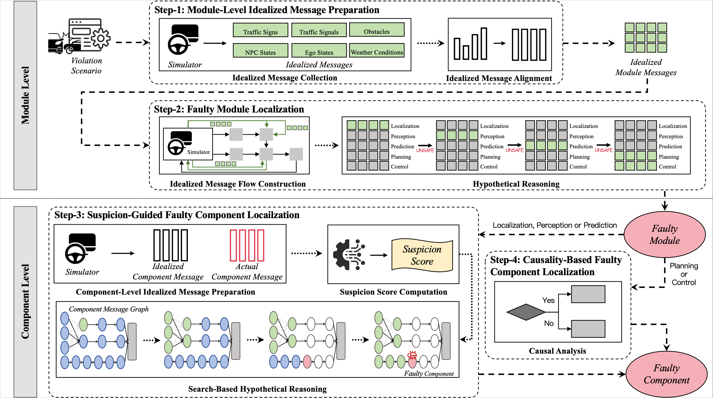

#  Poirot

Poirot: Automatic Root Cause Analysis of Safety Violations in ADS Simulation Testing via Hypothetical Reasoning

This work has been submitted to FSE 2026.

This repo contains the code and benchmark used in Poirot.


## Overview


In the module-level localization phase, Poirot (i.e., Step-1 in Fig. 1) replays the violation scenario to collect idealized messages from the simulator, and aligns them temporally to obtain the idealized module messages. Next, Poirot constructs idealized message flows for modules in the ADS, and applies hypothetical reasoning to identify the faulty module by iteratively replacing actual modules with idealized modules, which are virtual modules publishing idealized messages, and checking whether the violation disappears.

In the component-level localization phase, if the faulty module is the localization, perception, or prediction module, Poirot obtains the idealized component messages and actual component messages within the faulty module, via scenario replaying. By performing differential analysis between these two types of messages, Poirot computes the suspicion score for each component. Then, Poirot applies a suspicion-guided search strategy on the component message graph (𝐶𝑀𝐺) of the faulty module to reduce the fault space and accelerate the identification of the faulty component. If the faulty module is the planning or the control module, Poirot  employs causal analysis to enable fine-grained localization.


## Directory Structure

```
Poirot/
├── benchmark/                      # Benchmark
│   ├── apollo/                     # Apollo-specific scenario files and ADS versions
│   ├── autoware/                   # Autoware-specific scenario files and ADS versions
│   ├── fault injection/            # Code for fault injection
│   ├── NPC_behavior/               # NPC behavior simulation modules
│   └── test_scenario.py            # Main testing script for scenarios
├── config/                         # Configuration files for different ADS modules
│   ├── control/                    
│   ├── localization/               
│   ├── perception/                 
│   ├── planning/                   
│   └── prediction/                 
├── custom_component/                
│   ├── localization/               
│   ├── perception/                 
│   └── prediction/     
├── data/                           # Data
├── proto/                          
├── toolset/                        # Utility tools and helper functions     
├── img/                            
├── main.py                         # Main entry point for Poirot execution
├── msg.py                          # Message processing and handling
├── gt.py                           # Ground truth generation and validation
└── build_proto.sh                  # Script to build protocol buffer files
```

## Use Poirot
Here, we take the usage of Poirot applied to Apollo as an example.

### Preparation
1. Install Apollo and SORA-SVL
2. It is recommended to download ***Poirot*** directly to Apollo folder
3. Before build Apollo, move folder `custom_component` into `/apollo/modules` in Apollo folder
4. Build Apollo
5. In Poirot folder, check `requirements.txt` to create satisfied environment
### How to use
1. Edit paths in `build_proto.sh` and run `sh build_proto.sh`, the results are already in folder `proto`
2. If there is a scenario similar to the benchmark's definition, you can directly use the script `test_scenario.py` in the folder `benchmark` to obtain data, including `.record.00000` and `.obj`. Or you can obtain these two using your method without such a scenario file, as long as the data format is the same.
3. ***Docker:*** In Apollo, under the path `/apollo/Poirot`, run `python msg.py --process`
4. ***Environment:*** In command line, under the path `/apollo/Poirot`, run `python gt.py`
5. ***Docker:*** In Apollo, under the path `/apollo/Poirot`, run `python msg.py --refine`
6. ***Environment:*** Run Apollo bridge and LGSVL. In command line, under the path `/apollo/Poirot`, run `python main.py`,then wait for results!
