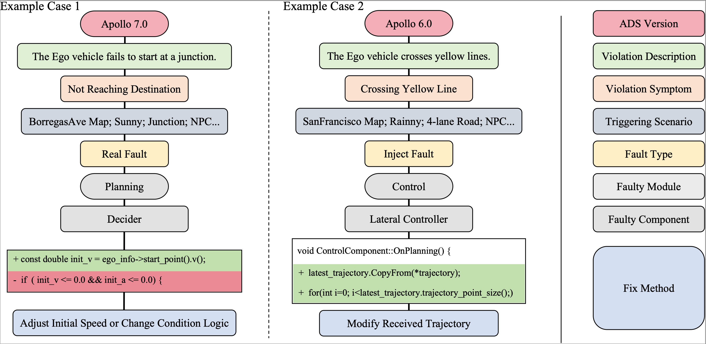

# Poirot: Benchmark for Root Cause Analysis in ADS Simulation Testing

Our benchmark consists of 42 collision scenarios, 14 running red light scenarios, 10 crossing yellow line scenarios, and 14 scenarios where the ADS fails to reach the destination, and it covers the 5 modules and 28 unique components in these two multi-module ADSs, i.e., Apollo and Autoware. The time duration of these scenarios ranges from 10 seconds to 35 seconds. Each case in the benchmark includes the ADS version, the violation description, the violation symptom, the triggering scenario, the fault type, the root cause (i.e., the faulty module, and the faulty component), and the corresponding fix method.